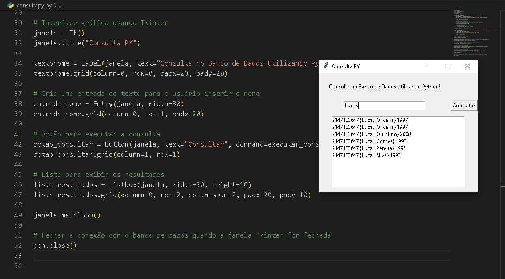

<h1 align="center">Consulta Python</h1>

 

 

# Tecnologias
Este projeto foi desenvolvido utilizando:
    
          
 
 

# Status do projeto
Concluido.

 

# Inspiração
Projeto que se conecta em um banco de dados e com base em um filtro ele faz uma consulta no banco de dados

 

